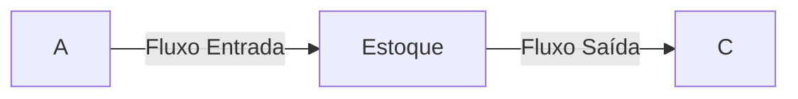
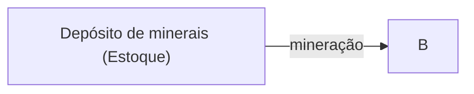
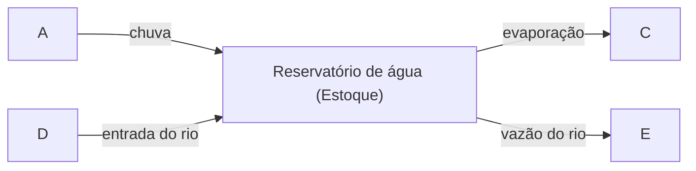

pg 62

> Se uma fábrica é demolida, mas a racionalidade que a produziu é deixada em pé, essa racionalidade produzirá outra fábrica. Se uma revolução destrói um governo, mas os padrões sistemáticos de pensamento que o produziram são preservados, esses padrões se repetirão (...) Há muita conversa sobre o sistema. E muito pouco entendimento.  
>> Ref: Zen e a arte da manutenção de motocicletas - Robert Pirsig  

:::youknow
Um sistema é um conjunto interconectado de elementos organizados coerentemente de modo a obter alguma coisa.
:::

Um sistema é composto por três tipos de coisas:

| Tipo               | Descrição                                       |
| ------------------ | ----------------------------------------------- |
| Elementos          | Executam alguma ação                            |
| Interconexões      | Elementos se inter-relacionam através de fluxos |
| Função / Propósito | O objetivo que o sistema busca alcançar         |

:::tip
Um sistema é mais que a soma de suas partes. E pode exibir um comportamento adaptativo, dinâmico, propositado, defensivo e, às vezes, evolucionário.
:::

Como saber se você está olhando para um sistema ou apenas para um conjunto de coisas?  
A) Você consegue identificar as partes? E...  
B) As partes influenciam umas às outras? E...  
C) As partes juntas produzem um efeito diferente a partir do efeito de cada uma das partes? E talvez...  
D) O efeito, o comportamento ao longo do tempo, persiste em circunstâncias diferentes?  

:::tip
Muitas interconexões nos sistemas operam por meio de um fluxo de informações. As informações mantém os sistemas juntos e desempenham um grande papel no modo como operam.
:::

A parte menos óbvia de um sistema, que é sua função ou seu propósito, é a que mais influencia o comportamento de um sistema.

## Estoque
Um estoque é a base de qualquer sistema, são os elementos do sistema que vocè pode ver, sentir, contar ou medir em qualquer momento.

:::tip
Um estoque é o histórico das mudanças de fluxo em um sistema.
:::

O estoque muda ao longo do tempo por causa das ações de um fluxo.

### 1) Fluxo de Entrada e Saída

### 2) Fluxo apenas Saída

### 3) Fluxo Multiplas Entradas e Saídas

- Enquanto a soma de todas as entradas exceder a soma de todas as saídas, o nível do estoque aumentará.

- Enquanto a soma de todas as saídas exceder a soma de todas as entradas, o nível do estoque diminuirá.

- Se a soma de todas as entradas for igual à soma de todas as saídas, o nível do estoque permanecerá constante. Manterá um equilíbrio dinâmico.

:::tip
Um estoque pode ser aumentado tanto diminuindo o fluxo de saída quanto aumentando o fluxo de entrada.  
Há mais de uma maneira de encher uma banheira.
:::

<mark>Estoques se modificam devagar</mark>, mesmo quando os fluxos de entrada ou de saída mudam rapidamente.  
Assim, podem gerar atrasos, criar lastros ou absorver choques em um sistema.

> Os estoques permitem que entradas e saídas sejam dissociadas,   independentes e temporariamente desequilibradas entre si.

## Como o sistema dirige a si mesmo: feedback

Sistemas de controle do feedback de informações são fundamentais para a vida e para os empreendimentos humanos, desde o ritmo lento da evolução biológica até o lançamento dos mais recente satélite espacial. Tudo o que fazemos como indivíduos, como indústrias ou como sociedade ocorre no contexto de um sistema de feedback de informações.

:::tip
Um ciclo de feedback é formado quando as mudanças em um estoque afetam os fluxos de entrada ou de saída.
:::

Nem todos os sistemas têm ciclos de feedback. Alguns são cadeias abertas, relativamente simples, de estoques e fluxos.

Um ciclo de feedback é uma cadeia fechada de conexões causais oriundas de um estqoue, que atua mediante um conjunto de decisões, regras, leis físicas ou ações que dependem do nível do estoque e que, por meio de um fluxo, retornam ao estoque para alterá-lo.

### 1) Ciclos de feedback de equilíbrio 
<mark>O Sistema tende a manter o estoque em um nível estabilizado.</mark>  
São os mais comuns na natureza e na sociedade. Eles são os responsáveis tanto pela estabilidade quanto de resisência à mudança (Homeostase).

:::note
A homeostase (condição de funcionamento ideal para o organismo) é provocada por uma resistência natural à mudança quando já está em condições ideais.
:::

### 2) Ciclos de feedback de reforço (AKA. Feedback Positivo)
<mark>O sistema tende a aumentar o estoque quanto maior for seu nível ou diminuí-lo quanto menor for seu nível.</mark>  

Um círculo vicioso é um ciclo de feedback de reforço que tende a se auto-perpetuar. Intensifica qualquer direção de mudança que lhe seja imposta.

> Os lucros caíram porque o investimento caiu, e o investimento caiu porque os lucros caíram.

:::note
**Pense nisto:**  
Se A causa B, é possivel que B também cause A?
:::

### 3) Sistemas com dois ciclos de equilibrio conflitantes
<mark>Um sistema pode ter dois ciclos de feedback de equilíbrio que se reforçam mutuamente, mas que operam em direções opostas.</mark>

**Exemplo (Termostato):**  
O termostato liga o aquecedor quando a temperatura cai abaixo de um certo nível e o desliga quando a temperatura sobe acima de um certo nível. Porém o aquecedor não é instantâneo, então a temperatura sobe ou desce um pouco além do nível desejado e perde temperatura para o ambiente externo.

:::tip
Um ciclo de feedback de equilíbrio precisa ter seu objetivo definido para compensar os processos de entrada ou saída que afetam o estoque. Caso contrário, o processo de feedback ficará aquém ou além da meta definida para o estoque.
:::

:::info
As informações fornecidas por um ciclo de feedback - ainda que não físico - só podem afetar o comportamento futuro: não podem gerar um sinal com rapidez suficiente para corrigir o comportamento que gerou o feedback. Mesmo informações não físicas levam tempo para ser realimentadas no sistema.
:::